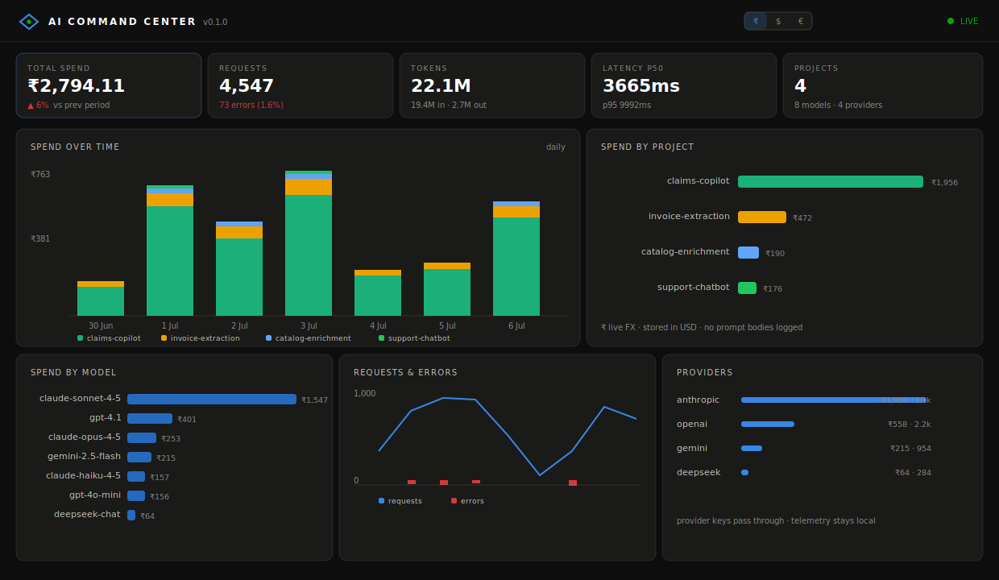
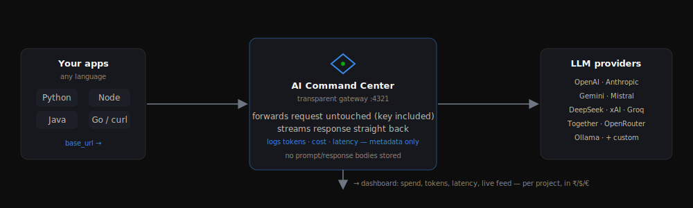

<div align="center">

# ◆ AI Command Center

**One gateway, every AI project, one dashboard.**

A dependency-free LLM gateway and self-hosted usage & cost dashboard. Point any
project at it - any language, one command - and watch tokens, cost, latency, and
errors for every AI product land in one place.

[](LICENSE)
[](package.json)
[](packages/gateway/package.json)
[](https://www.npmjs.com/package/ai-command-center)
[](packages/gateway/test)

<br/>



</div>

---

```bash
npx ai-command-center        # gateway + dashboard at http://localhost:4321
npx ai-command-center demo   # seed 14 days of realistic sample data to explore
```

Then point any project at it - the only change is a base URL, and your API key
never moves:

```python
from openai import OpenAI
client = OpenAI(base_url="http://localhost:4321/p/invoice-bot/openai/v1")
```

That's the whole integration. **Full docs & a live interactive demo:
[aicommandcenter.vercel.app](https://aicommandcenter.vercel.app)**

It began as the working implementation of an internal "AI Box" platform concept -
its SDK + LLM Gateway + cost-visibility slice, built to actually run - and is now
open-sourced so anyone can get a usage/cost dashboard for their AI projects with
no hassle.

## How it works

<div align="center">

</div>

Your app calls the LLM exactly as before, but through the gateway. It forwards the
request untouched (your API key included), streams the response straight back, and
reads token usage on the side to compute cost. Added latency: well under a
millisecond.

## Why

Most teams either fly blind on LLM spend or stand up a multi-service
observability stack (Postgres + ClickHouse + Redis + object storage). This is the
middle path: the numbers you actually need, from one command, on your own
machine, with **zero runtime dependencies**.

- **One line to onboard** - change a base URL (or one env var). No new library, no per-language SDK, no OpenTelemetry setup.
- **Any language** - it's an HTTP gateway. Python, JS, Java, Go, Rust, shell - identical.
- **Every provider** - OpenAI, Anthropic, Gemini, OpenRouter, Mistral, DeepSeek, xAI, Groq, Together, Ollama, and any OpenAI-compatible endpoint.
- **Cost you can trust** - exact per-request USD from real token counts (incl. cached tokens), shown in ₹ / $ / € with live rates.
- **Your keys, your data** - provider keys pass straight through; **prompt and response bodies are never stored** (metadata only); telemetry stays on your machine.
- **Team-ready** - optional login, teams, and per-project gateway keys, so members see only their team's projects.

## Integrate (any language)

The gateway is a transparent proxy. Every SDK supports a custom base URL, so
integration is one line - or zero, via environment variables. The
`/p/<project>` path segment (or an `x-aicc-project` header) groups calls on the
dashboard.

<table>
<tr><td>

**Python**
```python
from openai import OpenAI
client = OpenAI(base_url=
  "http://localhost:4321/p/app/openai/v1")

from anthropic import Anthropic
client = Anthropic(base_url=
  "http://localhost:4321/p/app/anthropic")
```

</td><td>

**JavaScript / Java / anything**
```js
new OpenAI({ baseURL:
  "http://localhost:4321/p/app/openai/v1" });
```
```bash
# zero code change - SDKs read this
export OPENAI_BASE_URL=\
  "http://localhost:4321/p/app/openai/v1"
```

</td></tr>
</table>

Print snippets for your own project: `npx ai-command-center snippets --project my-app`.
Full per-language guide (LangChain, Spring AI, curl, …): **[docs/integrate](https://aicommandcenter.vercel.app/docs/integrate)**.

**Batch jobs / unsupported providers** - report usage directly and it's priced the same way:

```bash
curl -X POST http://localhost:4321/api/track -H "Content-Type: application/json" \
  -d '{"project":"nightly-job","provider":"openai","model":"gpt-4o","tokensIn":52000,"tokensOut":9000}'
```

## How it compares

AI Command Center occupies a deliberately narrow slot: a self-hosted,
language-agnostic **cost/usage dashboard** that runs from one command with no
database. It is **not** a tracing platform, an eval framework, a prompt manager,
or a routing/failover gateway - tools like Langfuse, Helicone, LangSmith,
LiteLLM, and Portkey do far more on those axes. If you need them, use them.

Reach for this when the question is simply *"how many tokens and dollars is each
project spending, across many providers and languages, without shipping prompt
content anywhere or running a database?"*

Full, fact-checked comparison: **[docs/comparison](https://aicommandcenter.vercel.app/docs/comparison)**.

## CLI

```
npx ai-command-center            # start gateway + dashboard (default)
npx ai-command-center demo       # seed 14 days of sample data (tagged, removable)
npx ai-command-center clear      # remove demo data (--all wipes everything)
npx ai-command-center stats      # terminal usage/cost summary
npx ai-command-center snippets   # integration code for every language
npx ai-command-center user add   # manage accounts (first user = admin)
```

Flags: `--port` · `--host 0.0.0.0` (share on LAN) · `--data-dir` · `--config` ·
`--preset <name>` · `--no-auth`.

## Configuration, auth, security

All optional - the defaults are sensible. See the docs for the full reference:

- **[Configuration](https://aicommandcenter.vercel.app/docs/config)** - layered config, presets, currency, custom providers, pricing overrides.
- **[Auth & teams](https://aicommandcenter.vercel.app/docs/auth)** - open until you create the first admin, then login + per-project gateway keys + team-scoped visibility.
- **[Security](https://aicommandcenter.vercel.app/docs/security)** - keys pass through and are never logged; no message bodies stored; cross-origin protection so a random web page can't spend your keys or wipe telemetry.

## Measured, not claimed

The eval suite ([`evals/`](evals/), `npm run evals`, mock upstream - no keys, no network):

| Metric | Result |
|---|---|
| Added proxy latency (p50) | **< 1 ms** (negligible vs 300 ms-30 s LLM calls) |
| Cost accuracy | **0 mismatches** across 20 provider/model/token cases |
| Usage-parser coverage | **100%** of provider response shapes (stream + non-stream) |
| Gateway runtime dependencies | **0** |

Latest report: [`evals/REPORT.md`](evals/REPORT.md).

## Company vs open-source build

Same MIT codebase. The company build is just a **config preset** (branding,
defaults) loaded with `--preset` - no feature difference:

```bash
npx ai-command-center start --preset example
```

Add your own under `packages/gateway/presets/<name>.json`.

## Repo layout

```
packages/gateway     the npm package: CLI + proxy + dashboard (zero runtime deps)
packages/sdk-python  optional thin Python helper (aicc.init)
packages/sdk-js      optional thin JS helper (@ai-command-center/sdk)
evals/               reproducible overhead + cost-accuracy benchmarks
examples/            runnable Python / Node / curl / Java integrations
site/                the marketing + docs website (Next.js)
docs/                comparison, demo script
```

## Development

```bash
npm test          # 52 tests - mock upstream providers, no API keys needed
npm run evals     # overhead + cost-accuracy report
npm start         # run the gateway from source
cd site && npm run dev   # the website
```

Contributions welcome - see [CONTRIBUTING.md](CONTRIBUTING.md) and
[AGENTS.md](AGENTS.md). Security reports: [SECURITY.md](SECURITY.md).

## Current limitations (honest)

- Pricing ships as sane defaults but **will drift** - verify against provider price pages and override in config (unpriced models are flagged, never guessed).
- JSONL + in-memory aggregation is comfortable into the hundreds of thousands of records; beyond that the storage layer is small and swappable (SQLite/Postgres).
- Auth is username/password + signed cookies (no SSO yet) and telemetry isn't encrypted at rest - fine for an internal tool; review before external multi-tenant use.
- OpenAI Realtime/WebSocket APIs aren't proxied (HTTP only).

## License

[MIT](LICENSE) © 2026 Aditya Sarade. Not affiliated with OpenAI, Anthropic, or Google.
